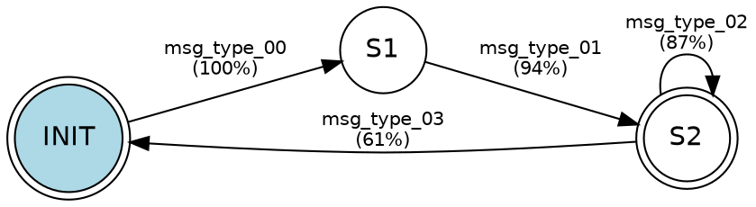

# ref2 view

render a graphviz dot file and open it in a viewer.

## synopsis

```
ref2 view <dot_file>
```

## description

attempts to render the dot file to svg using `dot(1)`, then opens the svg in the default application (`open` on macos, `xdg-open` on linux).

if `dot` is not installed, it prints the path to the dot file and exits cleanly.

## installing graphviz

```bash
brew install graphviz       # macos
sudo apt install graphviz   # debian / ubuntu
sudo dnf install graphviz   # fedora
```

## manual rendering

```bash
# svg
dot -Tsvg ref2_output/fsm.dot -o ref2_output/fsm.svg

# png
dot -Tpng ref2_output/fsm.dot -o ref2_output/fsm.png

# pdf
dot -Tpdf ref2_output/fsm.dot -o ref2_output/fsm.pdf
```

## example dot output

a typical fsm for a simple request-response protocol:


