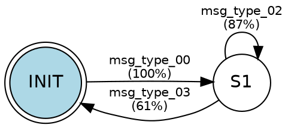

# phase 5 — output formats

**source:** `src/output/`

ref2 produces three output formats from the same inference results.

---

## json schema (`schema.json`)

a machine-readable description of the entire protocol: all message types, their fields, and the fsm.

```json
{
  "protocol": "unknown",
  "inferred_from": "capture.pcap",
  "message_types": [
    {
      "id": 0,
      "name": "msg_type_00",
      "fields": [
        {
          "offset":  0,
          "length":  4,
          "type":    "MAGIC",
          "name":    "field_00_magic",
          "entropy": 0.0
        },
        {
          "offset":  4,
          "length":  2,
          "type":    "LENGTH",
          "name":    "field_01_length",
          "entropy": 4.2
        },
        {
          "offset":      6,
          "length":      1,
          "type":        "ENUM",
          "name":        "field_02_enum",
          "entropy":     1.58,
          "enum_values": [1, 2, 3]
        },
        {
          "offset":  7,
          "length":  0,
          "type":    "PAYLOAD",
          "name":    "field_03_payload",
          "entropy": 7.9
        }
      ]
    }
  ],
  "fsm": {
    "states": [
      { "id": 0, "label": "INIT", "is_initial": true,  "is_accepting": false },
      { "id": 1, "label": "S1",   "is_initial": false, "is_accepting": true  }
    ],
    "transitions": [
      { "from": 0, "to": 1, "message_type": 0, "schema_ref": "msg_type_00", "frequency": 1.0 },
      { "from": 1, "to": 1, "message_type": 2, "schema_ref": "msg_type_02", "frequency": 0.87 },
      { "from": 1, "to": 0, "message_type": 3, "schema_ref": "msg_type_03", "frequency": 0.61 }
    ]
  }
}
```

### field types

| value | meaning |
|---|---|
| `MAGIC` | constant bytes, usually a protocol signature |
| `CONSTANT` | fixed value that is not magic |
| `ENUM` | small set of distinct values (2–16) |
| `SEQUENCE_NUMBER` | monotonically increasing within a session |
| `LENGTH` | encodes the total or payload length |
| `PAYLOAD` | high-entropy variable-length data |
| `NONCE` | high-entropy fixed-length, non-repeating |
| `STRING` | printable ascii data |
| `OPAQUE` | unclassified |

---

## graphviz dot (`fsm.dot`)

a directed graph of the protocol fsm. render with:

```bash
dot -Tsvg ref2_output/fsm.dot -o ref2_output/fsm.svg
```

- initial state has a filled blue background
- accepting states use `doublecircle` shape
- transition labels show schema name and frequency percentage



---

## scapy dissector (`dissector.py`)

a python file containing one scapy `Packet` subclass per inferred message type.

```python
# auto-generated by ref2 — do not edit manually
from scapy.packet import Packet
from scapy.fields import *

class MsgType00(Packet):
    name = "msg_type_00"
    fields_desc = [
        XIntField("field_00_magic", 0),
        ShortField("field_01_length", 0),
        ByteEnumField("field_02_enum", 1, {1: "val_00", 2: "val_01", 3: "val_02"}),
        StrLenField("field_03_payload", b"", length_from=lambda p: p.field_01_length - 7),
    ]
```

**field mapping:**

| ref2 type | scapy field class |
|---|---|
| `MAGIC` (1 byte) | `ByteField` |
| `MAGIC` (2 bytes) | `XShortField` |
| `MAGIC` (4 bytes) | `XIntField` |
| `ENUM` (1 byte) | `ByteEnumField` |
| `ENUM` (2 bytes) | `ShortEnumField` |
| `LENGTH` (2 bytes) | `ShortField` |
| `LENGTH` (4 bytes) | `IntField` |
| `PAYLOAD` (variable, length known) | `StrLenField` |
| `PAYLOAD` (variable, length unknown) | `StrField` |
| `NONCE` (fixed) | `StrFixedLenField` |
| `STRING` | `StrNullField` |
| `SEQUENCE_NUMBER` | `IntField` / `ShortField` |

**usage:**

```python
from scapy.all import *
exec(open('ref2_output/dissector.py').read())

# decode raw bytes
pkt = MsgType00(b'\xde\xad\xbe\xef\x00\x0a\x01hello\x00')
pkt.show()

# use in a pcap loop
for pkt in rdpcap('capture.pcap'):
    if Raw in pkt:
        msg = MsgType00(bytes(pkt[Raw]))
        print(msg.field_02_enum, msg.field_03_payload)
```
